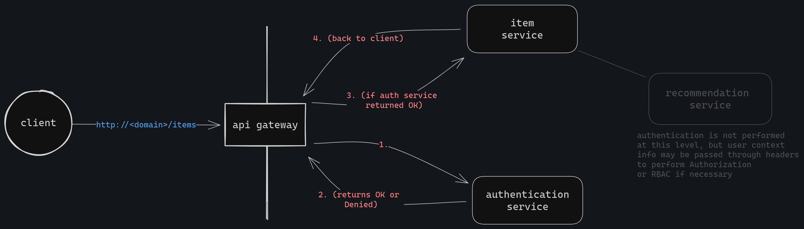

# gateway-forward-auth

in this scenario, [traefik](https://doc.traefik.io/traefik/) is used as the gateway.

learned:
- caveats
    - this approach is tricky for systems with very granular authorization requirements.
      - options
        1. the auth server could store role/permission logic for every backend service.
        2. the auth server could extract and forward roles from the jwt to downstream services through http headers.

- strengths
    - services do not need to be aware of authentication.
    - backend service-to-service communication is simple. just pass the user context  around.

alternative:
- scrap ForwardAuth and let each service handle its own auth logic.